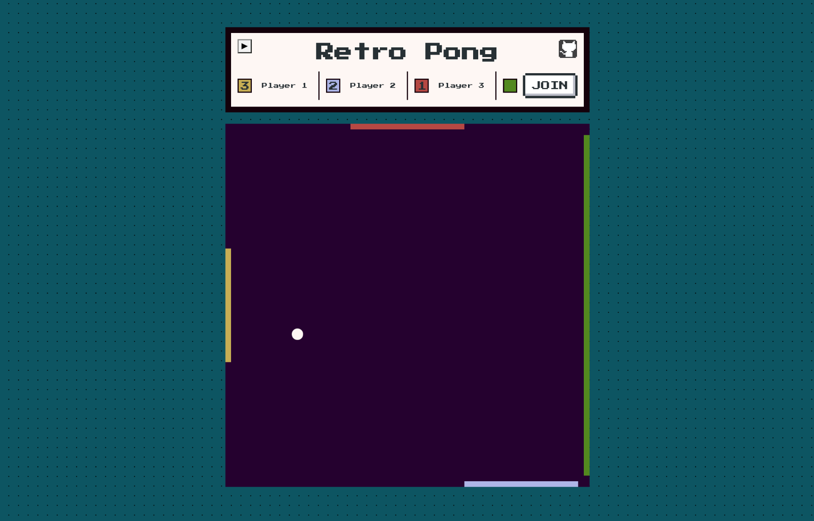

# Retro Pong Game

Network capable Pong.

- Nx mono repository, Angular 13 for the frontend, NestJS 8 for the backend
- CI/CD based on Heroku+Github, deploying on every main branch push
- All of the player and ball positions logic is located on the backend side, frontend is just for displaying data
- Position data sending/receiving via WebSockets
- 55+ FPS during the game - frontend is fully optimized, no extra angular change detections

## Try it
Open on [Heroku](https://retro-pong.herokuapp.com/)

## Roadmap

- Fix ball angle calculation on the backend side
- Optimize socket message count to reduce gameplay lag
- Add sounds to ball bounce, game statuses

## Development server

Run `start:develop` for a dev server. Navigate to http://localhost:4200/. The app will automatically reload if you change any of the source files.

## Running unit tests

Run `ng test my-app` to execute the unit tests via [Jest](https://jestjs.io).

Run `nx affected:test` to execute the unit tests affected by a change.

## Running end-to-end tests

Run `ng e2e my-app` to execute the end-to-end tests via [Cypress](https://www.cypress.io).

Run `nx affected:e2e` to execute the end-to-end tests affected by a change.
